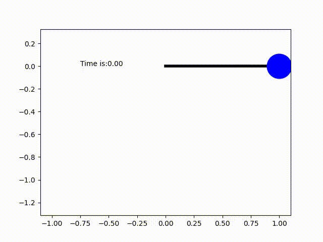

# Moving pendulum next frame prediction
This repository contains Python code for predicting the next frame of a moving pendulum using a CNN-LSTM architecture. The animation of a simple pendulum is generated based on its dynamic equations, and each frame is fed to a Deep Neural Network (DNN) to predict up to the next 50 frames.

The DNN architecture consists of three main components: the encoder, recurrent layers, and decoder. The encoder employs CNN layers for feature extraction and dimensionality reduction. These features are then passed through recurrent layers (RNN, LSTM, or GRU) to predict the pendulum's next possible position. Finally, the decoder converts the feature vector back into the original image space for a sensible representation.

  
